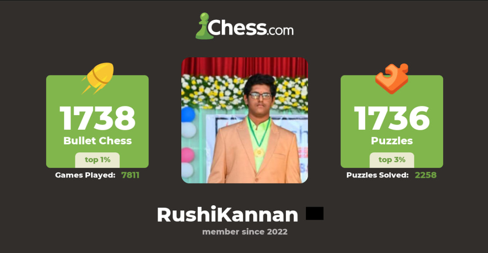
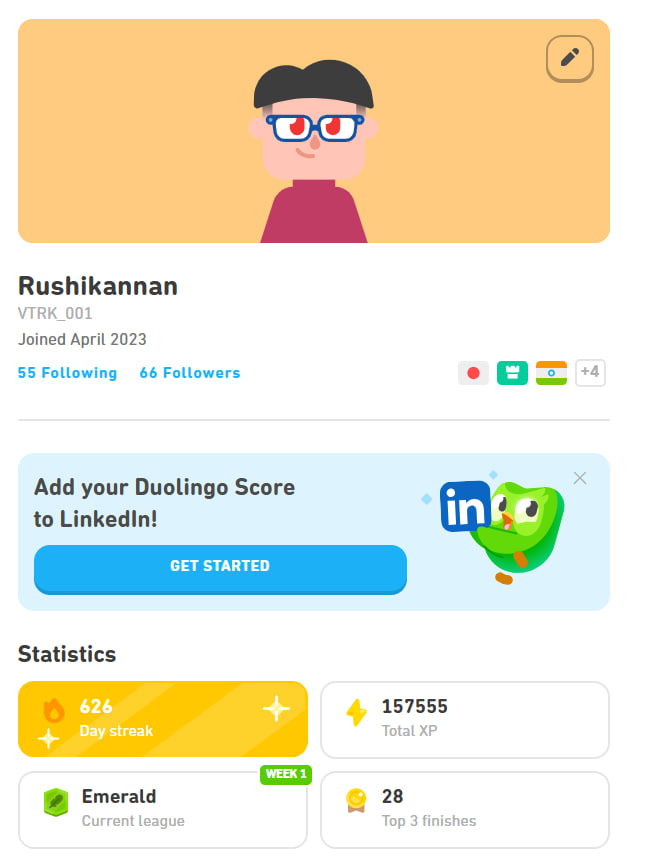

# 👋 V T Rushi Kannan

🚀 Artificial Intelligence Engineer | 🔬 Researcher | 💻 Developer  

I am a B.Tech student in Artificial Intelligence and Data Science, passionate about building practical and research-driven AI systems. My work focuses on Natural Language Processing, Computer Vision, and solving real-world problems with scalable solutions.

---

## 🧠 About Me

- 🎓 B.Tech in AI & Data Science (2023–2027)  
- 🏆 Research Intern at IIIT Kottayam — FIRE 2025 (Rank 1)  
- 🌍 Research Collaboration with University of Pittsburgh (OCT Imaging)  
- ⚙️ Strong foundation in Data Structures, Algorithms, and AI systems  

---

## 🛠️ Technical Skills

**💻 Programming**  
Python  

**🤖 Machine Learning**  
Logistic Regression, SVM, Random Forest  

**🧠 Deep Learning**  
LSTM, BiLSTM  

**📊 NLP & Transformers**  
BERT, DeBERTa-v3, ELECTRA  

**👁️ Computer Vision**  
Image Processing, Segmentation, YOLO, U-Net, ResNet  

**⚙️ Tools & Frameworks**  
PyTorch, TensorFlow, Hugging Face, Git  

---

## 🚀 Projects

### 🧬 Gel Scope AI
AI-based system for analyzing gel electrophoresis images with accurate detection and structured biological data extraction.

### 📊 CryptoQ Sentiment Analyzer
Hierarchical NLP pipeline using transformer models for fine-grained sentiment and intent classification.

---

## 🏆 Achievements

- 🥇 Rank 1 — FIRE 2025 CryptoNLP Shared Task  
- 🎤 Invited to present at IIT (BHU) Varanasi  
- 🎓 NPTEL Machine Learning (IIT Kharagpur) — ELITE  
- ♟️ Top 1% Global Bullet Chess Player  

---

## ♟️ Chess

♟️ Competitive chess has strengthened my pattern recognition, fast decision-making, and strategic thinking.

---

## 🌍 Duolingo Journey 🇯🇵

🔥 Maintaining a 600+ day streak while learning Japanese, aligned with my goal of working in Japan.

---

## 📫 Contact

- 📧 Email: rushikannan@gmail.com  
- 💻 GitHub: https://github.com/Rushikannan2  
- 🔗 LinkedIn: https://linkedin.com/in/vt-rushikannan  

---

⭐ *Always open to collaboration, research opportunities, and building impactful AI systems.*
